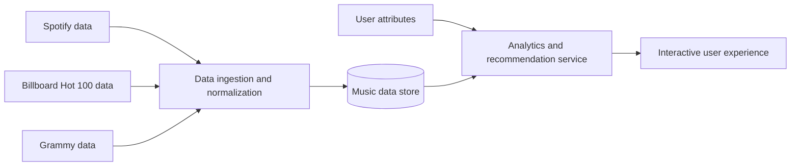

# Music Intelligence Platform

A personal music analytics and recommendation project that combines listening
behavior with Spotify metadata, Billboard Hot 100 performance, Grammy history,
and user preferences to produce richer insights and more thoughtful music
recommendations.

> **Status:** Under active development. This repository currently contains the
> project documentation and architecture plan. Application code, reproducible
> data pipelines, and a public demo will be added as development progresses.

## Why I’m Building This

Most music applications explain listening behavior using simple summaries such
as top artists, favorite genres, or total minutes played. Those summaries are
interesting, but they rarely explain *why* a listener gravitates toward certain
music or how personal taste relates to critical recognition and popular success.

Music Intelligence Platform is designed to provide a deeper view. It brings
together several perspectives on music:

- Personal listening behavior and stated user preferences
- Track, artist, album, genre, and audio metadata from Spotify
- Historical performance on the Billboard Hot 100
- Grammy nominations and awards

The goal is to turn those sources into understandable listening insights and
recommendations that account for more than popularity or genre similarity.

## Planned Capabilities

### Listening analysis

- Build a multidimensional profile of a user’s music taste
- Identify patterns across artists, genres, eras, and track characteristics
- Compare personal listening habits with chart performance and award history
- Explain which attributes most strongly characterize a listener’s preferences

### Music recommendations

- Recommend tracks and artists using listening history and user attributes
- Balance familiar preferences with opportunities for discovery
- Incorporate commercial performance and critical recognition as optional
  recommendation signals
- Explain why each recommendation may fit the listener

### Music exploration

- Explore relationships among Spotify metadata, Billboard rankings, and Grammys
- Compare artists and tracks across personal, popular, and critical dimensions
- Surface overlooked music that shares meaningful characteristics with a user’s
  favorites

## Data Sources

| Source | Intended role |
| --- | --- |
| Spotify | Listening activity and artist, album, track, genre, and audio metadata |
| Billboard Hot 100 | Historical chart presence and commercial performance |
| Grammy data | Nominations, awards, categories, and critical recognition |
| User attributes | Explicit preferences and contextual signals used to personalize analysis |

Data access, storage, and redistribution will follow the terms of each source.
Private user data and credentials will not be committed to this repository.

## Conceptual Architecture

The data layer will reconcile artist, track, album, and release identities across
sources before serving analytical queries and recommendation features. More
detailed design notes are available in
[docs/architecture.md](docs/architecture.md).

## Recommendation Approach

The recommendation system is intended to combine multiple signal types rather
than rely on a single popularity score:

1. **Preference signals** — artists, genres, eras, and track characteristics a
   user tends to favor.
2. **Behavioral signals** — patterns derived from the user’s listening activity.
3. **Contextual signals** — Billboard performance and Grammy recognition where
   they add useful context.
4. **Discovery controls** — adjustments that balance similarity, diversity,
   novelty, and popularity.
5. **Explanations** — human-readable reasons connecting each recommendation to
   the listener’s profile.

The final implementation and evaluation methodology will be documented alongside
the source code. Recommendation quality will be assessed with reproducible tests
instead of being inferred from popularity alone.

## Design Priorities

- **Explainability:** Insights and recommendations should include understandable
  reasons, not only scores.
- **Data quality:** Entities from different datasets must be matched carefully,
  with ambiguous records handled explicitly.
- **User control:** Listeners should be able to influence the balance between
  familiar music and discovery.
- **Privacy:** Personal listening information and authentication credentials must
  remain outside version control.
- **Reproducibility:** Data preparation, analysis, and evaluation should be
  repeatable from documented scripts.

## Local Development

The executable application has not yet been added to this repository. Once the
implementation is available, this section will include exact prerequisites,
installation commands, database setup, environment variables, seed data, tests,
and startup instructions.

Configuration will use a local `.env` file based on `.env.example`. Real secrets
must never be committed.

## Roadmap

- [ ] Define and document the unified music data model
- [ ] Build reproducible ingestion and entity-resolution pipelines
- [ ] Implement exploratory music and listening analytics
- [ ] Establish a transparent recommendation baseline
- [ ] Add recommendation explanations and discovery controls
- [ ] Evaluate recommendation relevance and diversity
- [ ] Build the interactive application
- [ ] Add automated tests, screenshots, and a public demo

## Project Ownership

Music Intelligence Platform is being developed as a personal portfolio project.
I am responsible for its product direction, data design, analysis, recommendation
approach, application architecture, implementation, testing, and documentation.
Third-party data, libraries, and other resources will be credited according to
their respective terms.

## License

No open-source license has been selected yet. Until a license is added, the code
and documentation remain under standard copyright protections. Dataset and API
usage is also subject to the terms of the respective providers.

## Disclaimer

This is an independent project and is not affiliated with, endorsed by, or
sponsored by Spotify, Billboard, the Recording Academy, or the Grammy Awards.
All product names and trademarks belong to their respective owners.
